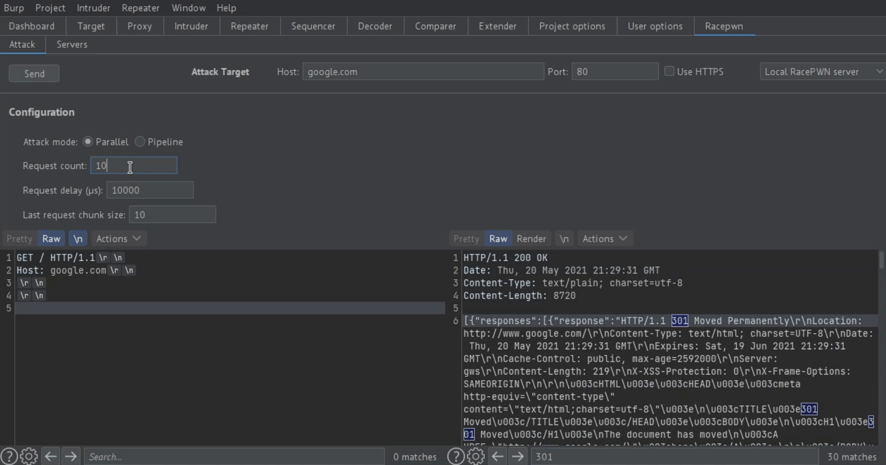
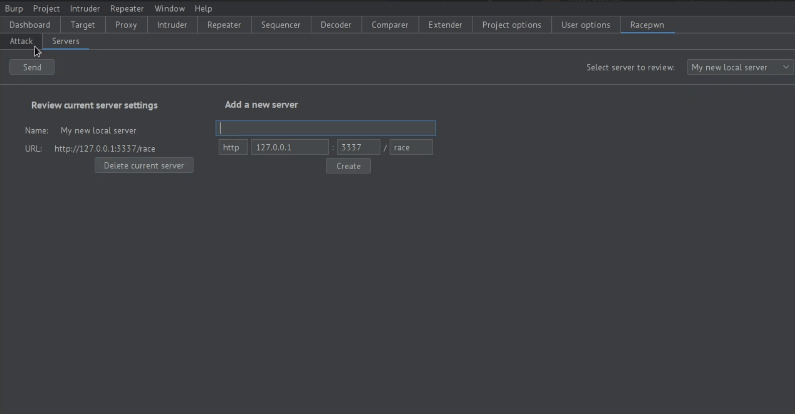

# RacePWN Burp plugin

## Description
Burp-Racepwn is a [Burp Suite](https://portswigger.net/burp) extension that integrates [RacePWN](https://github.com/racepwn/racepwn) framework to provide quick access for advanced race condition exploitation techniques.

## Warning
Extensions is in active development as a semester project, work on its availability for users is still in a very early stage. Also, in connection with this, the functionality is significantly different from the real state.

## Extension installing
### Build JAR
```bash
mvn package -f pom.xml
```
### Import in Burp
Go to _Extender_ - _Extensions_ - _"Add" button_ - Choose compiled JAR file.

## Usage

### Attack target
Set the host, port, protocol of the attack target. This should be the server where you want the RacePWN server to send all its requests.
### RacePWN server management
You can use default RacePWN local server, which is supposed to be deployed on the same machine as Burp at the _3337_ port.
To use the external Racepwn server, you can add it to the _Servers_ tab, and it will be automatically used for the following attacks.
### Sending attack requests
- Specify the request body that will be sent in every request to the attack target.
- Select the appropriate attack mode (_parallel_ - send all requests separately, _pipeline_ - send all requests as one).
- Set the final number of requests to be sent.
- In case of parallel mode, set the delay between sending requests and the size of the last chunk.
- Click the send button and wait for the query result in the editor.

## Screenshots


